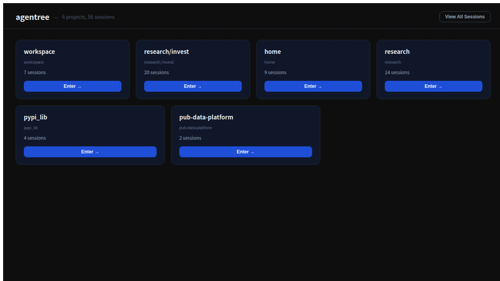

# Agentree

A Figma-like infinite canvas for supervising live [opencode](https://opencode.ai) agent session trees in real time.

Agentree sits on top of opencode and adds a visual layer: see all your running sessions at a glance, inspect message threads, approve permissions, send prompts, and trace fork/subtask lineage — without leaving a single browser tab.



---

## Quick start

If you already have [opencode](https://opencode.ai) running:

```bash
npx agentree
```

Agentree auto-detects opencode on `localhost:6543` or `localhost:4096`. Open http://localhost:3001 in your browser.

**Options**

| Flag | Default | Description |
|------|---------|-------------|
| `--port`, `-p` | `3001` | Port for Agentree |
| `--opencode-url` | auto-detect | opencode server URL |

```bash
npx agentree --port 8080 --opencode-url http://localhost:6543
```

**DB location:** `~/.agentree/agentree.db`  
Override with `DB_PATH=./agentree.db npx agentree`.

### Docker

**Already have opencode running:**

```bash
docker compose up agentree
```

**Need opencode too (full stack):**

```bash
docker compose --profile with-opencode up
```

Open http://localhost:3001 in your browser.

---

## How it works

```
opencode (Docker)          Agentree server (Node/Hono)        Agentree client (React)
      |                              |                                  |
  sessions,          <-- proxy -->   |  -- SSE stream -->   canvas, panel, approvals
  messages,                          |
  events                        SQLite overlay
                               (node positions,
                               project metadata,
                               session relations)
```

- **opencode** is the source of truth for sessions, messages, and execution state.
- **Agentree server** proxies opencode, rebroadcasts its SSE event stream, and persists canvas layout in a local SQLite database.
- **Agentree client** renders the canvas and panel, consuming SSE for live updates.

---

## Prerequisites

| Tool | Version |
|------|---------|
| Node.js | 20+ |
| pnpm | 9+ |
| Docker | any recent |

---

## Setup

### 1. Install dependencies

```bash
pnpm install
```

### 2. Configure opencode

```bash
cp .env.opencode.example .env.opencode
```

Edit `.env.opencode` as needed:

| Variable | Default | Description |
|----------|---------|-------------|
| `OPENCODE_IMAGE` | `ghcr.io/anomalyco/opencode:latest` | Docker image for opencode |
| `OPENCODE_PORT` | `6543` | Port opencode listens on |
| `OPENCODE_WORKSPACE_DIR` | `..` | Host path mounted as `/workspace` inside the container |
| `OPENCODE_CONFIG_HOST_DIR` | `~/.config/opencode` | opencode config persistence |
| `OPENCODE_DATA_HOST_DIR` | `~/.local/share/opencode` | opencode session data persistence |
| `OPENCODE_SERVER_USERNAME` | `opencode` | HTTP basic auth username (optional) |
| `OPENCODE_SERVER_PASSWORD` | _(empty)_ | HTTP basic auth password — set this to secure access |
| `TZ` | `Asia/Seoul` | Timezone inside the container |

> **Tip:** `OPENCODE_WORKSPACE_DIR=..` mounts the parent of the `agentree` directory as the workspace. If your repo root is elsewhere, set this to an absolute path.

### 3. Start opencode

```bash
docker compose --env-file .env.opencode -f docker-compose.opencode.yml up -d
```

Check it is healthy:

```bash
docker compose --env-file .env.opencode -f docker-compose.opencode.yml ps
# or
curl -u opencode:<your-password> http://localhost:6543/global/health
```

### 4. Run database migrations

```bash
pnpm run db:migrate
```

### 5. Start Agentree

```bash
pnpm run dev
```

| Service | URL |
|---------|-----|
| Agentree UI | http://localhost:5174 |
| Agentree API | http://localhost:3001 |
| opencode | http://localhost:6543 |

---

## UI walkthrough

### Home screen

When you open the app you land on the **Home screen** — a grid of project cards.

- Projects are **auto-created** from the working directory of each session (e.g. sessions running inside `apps/foo` all map to one project card).
- Project names are **editable inline** — click the name to rename.
- Click a project card to open its canvas.
- **View All** opens a canvas with every session regardless of project.

### Canvas

The canvas shows sessions as nodes connected by edges.

#### Node status colors

| Color | Meaning |
|-------|---------|
| Green | Session is actively running |
| Yellow | Waiting for a permission grant |
| Orange | Waiting for an answer to a question |
| Blue | Idle (waiting for a prompt) |
| Gray | Completed / done |
| Red | Failed or errored |

#### Interactions

| Action | How |
|--------|-----|
| Select a session | Click its node |
| Pan | Click and drag the canvas background |
| Zoom | Scroll wheel |
| Reposition a node | Drag the node — position is saved automatically |
| Create a relation | Draw an edge from one node's handle to another, then choose `linked` or `detached` |
| New session | Click **+ New Session** in the top toolbar |

#### Toolbar

- **+ New Session** — opens a dialog to create a new opencode session with an optional title.
- **View: Recent / All** — toggle between the 8 most-recently-active root sessions and every session.
- **Compat info** — shows opencode SDK/server version compatibility status. A warning here means some features may not work.
- **← Projects** — return to the Home screen.

### Session panel

Click any node to open the **Session panel** on the right.

#### What you can see

- Session ID, parent session, working directory, timestamps.
- Full message thread with rendered parts:
  - **Text** — assistant prose.
  - **Reasoning** — model chain-of-thought (if available).
  - **Tool** — tool calls with input/output, running / completed / error states.
  - **Patch** — unified diffs of file changes.
  - **Subtask** — linked child session spawned by this session.
  - **File** — file references.
- Latest provider/model/cost metadata.

#### Approval queue

When a session is paused waiting for approval, the panel shows an inline queue:

- **Permission requests** — choose *Once*, *Always*, or *Reject*.
- **Questions** — select from offered answers or reject.

The floating **ApprovalQueue** badge at the bottom of the canvas also shows pending counts across all sessions. Click it to jump to the oldest unanswered request.

#### Actions

- **Send prompt** — type and submit a message to the session.
- **Create subtask** — spin up a child session with a prompt, description, agent, and model.
- **Abort** — cancel the current running operation.

---

## Project structure

```
src/
  client/
    HomeScreen.tsx            # Project cards grid
    App.tsx                   # Root: HomeScreen ↔ Canvas routing
    canvas/
      AgentCanvas.tsx         # React Flow canvas + toolbar
      AgentNode.tsx           # Session node renderer
      AgentEdge.tsx           # Custom edge renderer
      ProjectTabBar.tsx       # Per-project tab strip
      SessionListSidebar.tsx  # Collapsible session list
    panel/
      SessionPanel.tsx        # Right-side detail + message thread
      ApprovalQueue.tsx       # Floating approval badge
      SubtaskDialog.tsx       # Create subtask modal
    store/
      agentStore.ts           # Zustand store + SSE event handling

  server/
    index.ts                  # Hono server entry point
    db/
      schema.ts               # Drizzle ORM table definitions
      index.ts                # DB instance + helpers
    routes/
      session.ts              # /api/session/* — CRUD + prompt/subtask
      canvas.ts               # /api/canvas/* — node position persistence
      tree.ts                 # /api/tree — full graph snapshot
      project.ts              # /api/project/* — project management
      system.ts               # /api/health
    opencode/
      types.ts                # Normalized AgentreeSession / Message types
      compat-1.3.ts           # Adapter for @opencode-ai/sdk 1.3.x
    sse/
      broadcaster.ts          # SSE fan-out to all connected clients
```

---

## Database

SQLite file is created at `agentree.db` in the project root on first run.

| Table | Purpose |
|-------|---------|
| `project` | One row per project; stores name and directory key |
| `canvas_node` | Per-session canvas position, pin state, detach state |
| `session_fork` | Fork lineage (auto-detected from opencode) |
| `session_relation` | User-drawn edges between sessions (linked / detached) |
| `task_invocation` | Subtask → child session linkage |

To regenerate migrations after schema changes:

```bash
pnpm run db:generate
pnpm run db:migrate
```

---

## Development

```bash
# Run all unit tests
pnpm test

# Run opencode integration tests (requires live opencode)
pnpm run test:opencode

# Build for production
pnpm run build

# Preview production build
pnpm run preview
```

---

## API reference

The Agentree server exposes a REST API at `http://localhost:3001/api`.

| Method | Path | Description |
|--------|------|-------------|
| `GET` | `/api/health` | Health check + opencode connection status |
| `GET` | `/api/tree` | Full session graph (nodes, edges, status, relations) |
| `GET` | `/api/events` | SSE stream for real-time canvas updates |
| `POST` | `/api/session` | Create a new session |
| `GET` | `/api/session/:id` | Get session details |
| `GET` | `/api/session/:id/messages` | Fetch message thread |
| `GET` | `/api/session/:id/diff` | File diffs |
| `GET` | `/api/session/:id/tasks` | Task invocations |
| `POST` | `/api/session/:id/prompt` | Send a prompt |
| `POST` | `/api/session/:id/subtask` | Create a subtask session |
| `PATCH` | `/api/canvas/:id` | Update node position / pin state |
| `POST` | `/api/permission/:requestID/reply` | Approve or reject a permission |
| `POST` | `/api/question/:requestID/reply` | Answer a question |
| `GET` | `/api/project` | List projects |
| `PATCH` | `/api/project/:id` | Rename a project |
| `DELETE` | `/api/project/:id` | Delete a project |

---

## Troubleshooting

**Canvas is empty / no sessions appear**

1. Confirm opencode is running: `docker compose --env-file .env.opencode -f docker-compose.opencode.yml ps`
2. Check `http://localhost:3001/api/health` — should return `{ "opencode": "ok" }`.
3. Check the browser console and server logs for SSE connection errors.

**Session stuck on yellow / orange**

The session is waiting for a permission grant or question answer. Open the session panel and respond in the Approval queue, or click the floating ApprovalQueue badge.

**Node positions reset on restart**

Positions are only persisted once you drag a node. Nodes you have never dragged are laid out by dagre on each page load.

**opencode version mismatch warning**

Agentree is tested against `@opencode-ai/sdk 1.3.x`. If the compat banner shows warnings, some features (e.g. certain event types) may not work as expected. Pin `OPENCODE_IMAGE` to a known-good tag in `.env.opencode`.

---

## License

Apache-2.0
